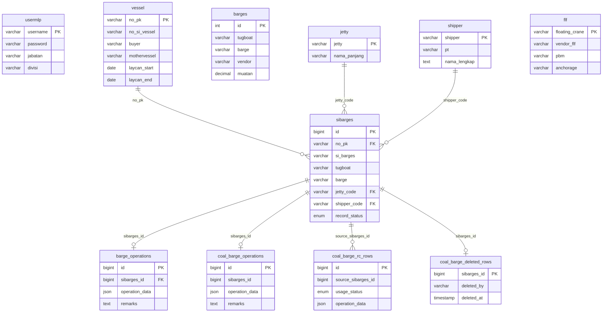
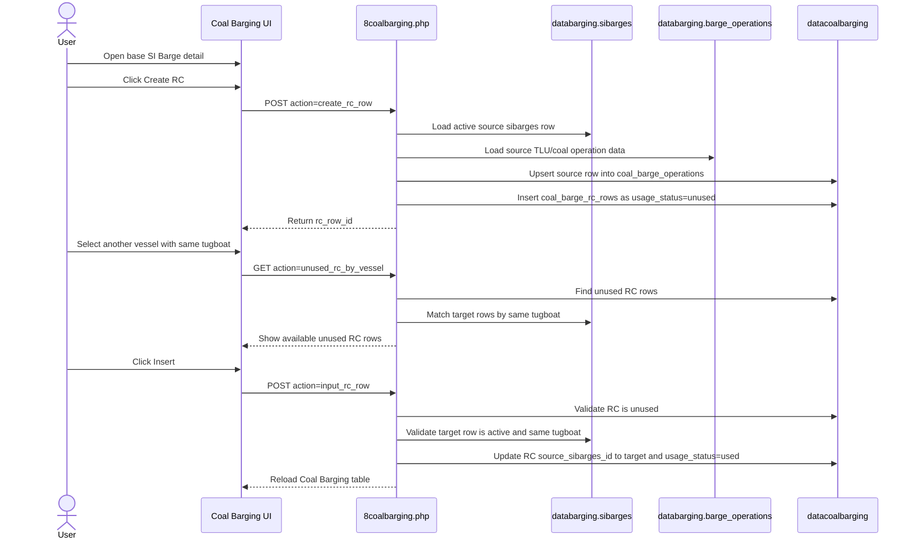

# MLP Logistics System - Code Flow

Use this as the slide explanation source. The SVG version is available at `docs/logistics-code-flow.svg`.

## Executive Flow

```mermaid
flowchart LR
  U[User Browser] --> L[login.php]
  L -->|SELECT username/password| AUTH[(databasemlp.usermlp)]
  AUTH -->|valid user| S[PHP Session<br/>username, jabatan, divisi]
  S --> H[home.php]
  H --> Layout[includes/header.php<br/>includes/sidebar.php<br/>includes/footer.php]
  Layout --> Role{Sidebar permission<br/>divisi / IT}

  Role -->|IT| Users[create_user.php<br/>User CRUD]
  Users --> AUTH

  Role -->|Operation / IT| Ops[Operation Menu]

  Ops --> Master[Master Data Pages<br/>1vessel, 2barges, 3jetty,<br/>4shipper, 5flf]
  Master -->|AJAX list/create/update/delete/import_csv| Barging[(databarging<br/>vessel, barges, jetty,<br/>shipper, flf)]

  Ops --> SI[6sibarges.php<br/>Shipping Instruction Barges]
  Barging -->|lookup vessel, tug/barge,<br/>jetty, shipper| SI
  SI -->|INSERT/UPDATE/DELETE| SITable[(databarging.sibarges)]
  SI -->|download| PDF[SI PDF]

  Ops --> TLU[7tluoperation.php<br/>TLU Operation]
  SITable -->|active SI Barges rows| TLU
  Barging -->|FLF validation/options| TLU
  TLU -->|save JSON operation_data| TLUDB[(databarging.barge_operations)]
  TLU -->|CSV template/import/export| TLUCSV[Operation CSV]

  Ops --> Coal[8coalbarging.php<br/>Coal Barging]
  SITable --> Coal
  TLUDB -->|seed initial operation data| Coal
  Coal -->|overlay coal-specific edits| CoalDB[(datacoalbarging<br/>coal_barge_operations,<br/>coal_barge_rc_rows,<br/>coal_barge_deleted_rows)]

  Coal --> RCCreate[Return Cargo: Create RC<br/>action=create_rc_row]
  RCCreate -->|clone selected barge data<br/>calculate remaining qty| RCPool[(coal_barge_rc_rows<br/>usage_status = unused)]
  RCPool -->|unused_rc_by_vessel<br/>match same tugboat| RCInsert[Insert RC into target vessel<br/>action=input_rc_row]
  RCInsert -->|source_sibarges_id becomes target<br/>usage_status = used| CoalDB
  CoalDB -->|delete used RC| RCPool
```

## Database Relationship View

## Return Cargo Flow in `8coalbarging.php`

Return Cargo behavior:

- `Create RC` only works from a normal/base Coal Barging row, not from an existing RC row.
- The created RC row starts as `unused`, with `status_act_rc = RC` and `status_act_act_rc = ACT&RC`.
- The RC quantity is derived from remaining cargo: planned/jetty quantity minus discharged or sea quantity values.
- An unused RC can only be inserted into a target SI Barge with the same `tugboat`.
- Deleting a used RC does not remove the record; it changes `usage_status` back to `unused`.
- Deleting an unused RC removes it from `coal_barge_rc_rows`.

## Slide Talk Track

1. Users authenticate through `login.php`; successful login stores `username`, `jabatan`, and `divisi` in the PHP session.
2. `home.php` and every protected Operation page check the session before rendering.
3. Shared layout files render the topbar/sidebar, and `includes/sidebar.php` decides which modules appear based on `divisi`; IT can see all modules.
4. Operation master-data pages are self-contained PHP modules: they render the UI and expose same-file AJAX endpoints for CRUD and CSV import.
5. `6sibarges.php` is the first transactional workflow. It combines Vessel, Barges, Jetty, and Shipper data to create SI Barges rows and SI PDFs.
6. `7tluoperation.php` reads active SI Barges rows, validates FLF selections, and stores operational timeline/quantity fields as JSON in `databarging.barge_operations`.
7. `8coalbarging.php` reads SI Barges and TLU data, creates/maintains the separate `datacoalbarging` database, and saves coal-specific edits without changing the TLU source data.
8. Return Cargo in `8coalbarging.php` is handled as a controlled RC pool: creating RC saves an unused row, inserting RC moves it to a matching target tugboat as used, and deleting used RC returns it to the unused pool.
